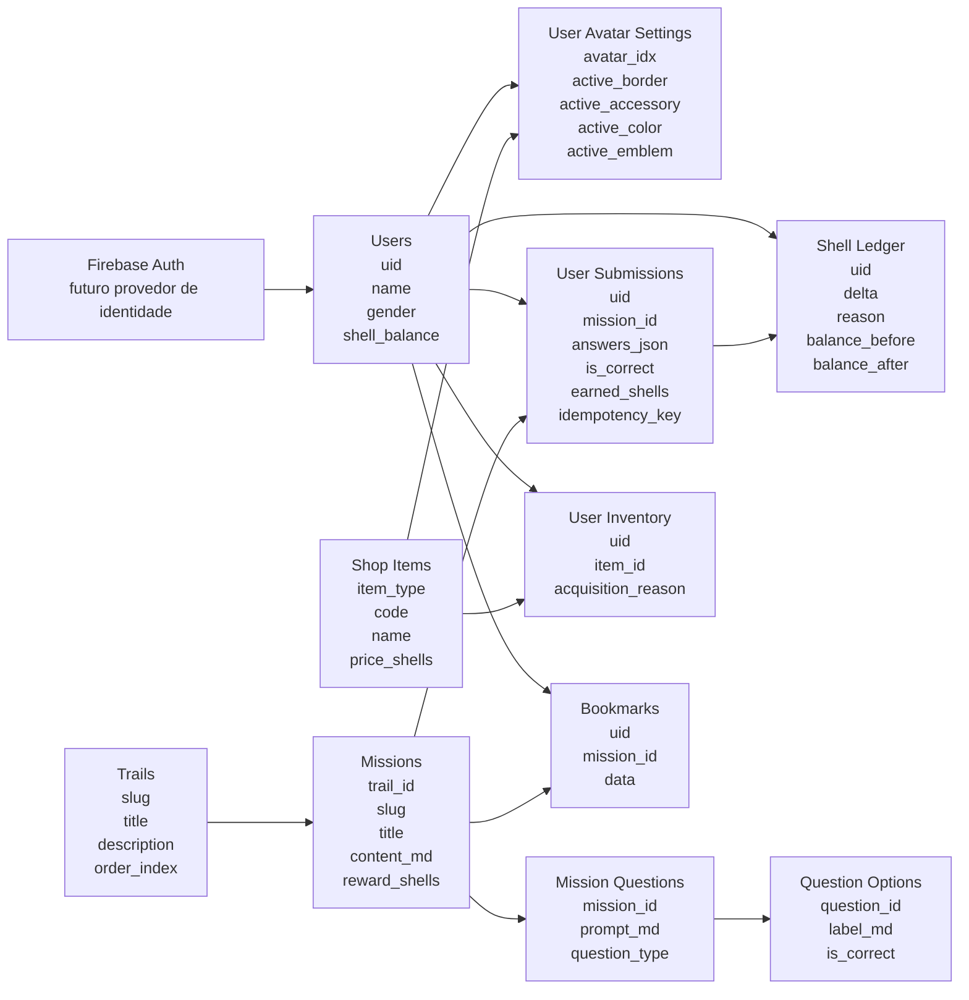

# Abstractio Backend

Backend em Node.js + Express + TypeScript para o projeto Abstractio.

O foco inicial é manter uma API enxuta node com express, typescript, PostgreSQL, validação com Zod e Firebase Auth.

## Estrutura do banco

O modelo abaixo resume as entidades principais do backend e como elas se relacionam.

## Leitura rápida do modelo

- `users` guarda o perfil base e o saldo atual de conchas
- `user_avatar_settings` concentra o visual ativo do usuário
- `trails` e `missions` organizam o conteúdo pedagógico
- `mission_questions` e `question_options` armazenam a estrutura das questões
- `user_submissions` registra as respostas enviadas e a idempotência
- `shell_ledger` é o histórico financeiro e a fonte de verdade das movimentações
- `shop_items` e `user_inventory` representam a loja e os itens desbloqueados
- `bookmarks` salva o ponto de retomada do usuário em uma missão