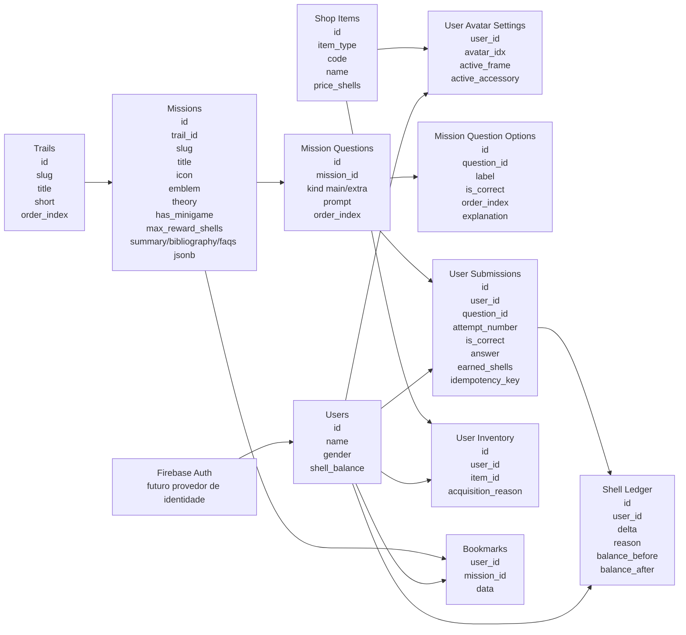

# Tentacle

Backend em Node.js + Express + TypeScript para o projeto Abstractio.

O foco inicial é manter uma API enxuta node com express, typescript, PostgreSQL, validação com Zod e Firebase Auth.

## Estrutura do banco

O modelo abaixo resume as entidades principais do backend e como elas se relacionam.

## Leitura rápida do modelo

- `users` guarda o perfil base e o saldo atual de conchas
- `user_avatar_settings` concentra o visual ativo do usuário (sem `active_color`/`active_emblem` — não existem no front hoje)
- `trails` e `missions` organizam o conteúdo pedagógico; `missions` carrega `summary`/`bibliography`/`faqs` como JSONB por serem conteúdo esparso (só ~3 das 29 missões usam cada um)
- `mission_questions` (principal ou extra, via `kind`) e `mission_question_options` armazenam a estrutura das questões — `order_index` é obrigatório porque o front valida a resposta certa pelo índice da opção, não pelo texto
- `user_submissions` é um log de cada tentativa (uma linha por tentativa, certa ou errada — não uma linha por missão); `attempt_number` decide a recompensa (100%/67%/33% do `max_reward_shells` da missão)
- `shell_ledger` é o histórico financeiro e a fonte de verdade das movimentações
- `shop_items` e `user_inventory` representam a loja e os itens desbloqueados
- `bookmarks` salva o ponto de retomada do usuário em uma missão

> Modelo fechado na Fase 2.1.5, validado linha a linha contra o frontend (`Abstractio`).